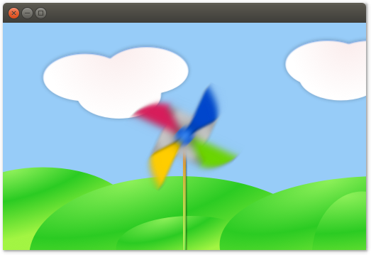

# QML Python example

Qt can be broadly split into two technologies: _Qt Widgets_ is the old core. It displays GUI elements in a way that is typical for operating systems such as Windows or macOS. A more recent alternative is _Qt Quick_. This technology is optimized for mobile and touch screen devices. It is better suited for very custom graphics and fluid animations.

Qt Quick uses a markup language called QML. This example shows how you can combine QML with Python.

<p align="center"></p>

The sample application displays a pin wheel in front of some hills. When you click with the mouse, the wheel rotates.

The QML code lies in [`main.qml`](main.qml). It's a testament to QML that it is quite easy to read:

```
import QtQuick 2.2
import QtQuick.Window 2.2

Window {
    Image {
        id: background
        source: "background.png"
    }
    Image {
        id: wheel
        anchors.centerIn: parent
        source: "pinwheel.png"
        Behavior on rotation {
            NumberAnimation {
                duration: 250
            }
        }
    }
    MouseArea {
        anchors.fill: parent
        onPressed: {
            wheel.rotation += 90
        }
    }
    visible: true
    width: background.width
    height: background.height
}
```

Executing the QML from Python is even easier. The code is in [`main.py`](main.py):

```
from PyQt5.QtQml import QQmlApplicationEngine
from PyQt5.QtWidgets import QApplication

app = QApplication([])
engine = QQmlApplicationEngine()
engine.load("main.qml")
app.exec_()
```

If you'd like further instructions how you can run this code for yourself, please see [here](../../README.md#running-the-examples).

Some code in this directory has special license requirements. For more information, please see [`LICENSE.md`](LICENSE.md).
