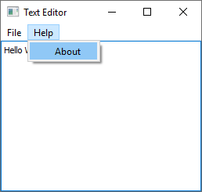

# Qt Text Editor

This example implements a simple text editor with (Py)Qt.

 

 

It has a surprising number of features:

 * A *File* menu for opening and saving files.
 * Keyboard shortcuts.
 * An *About* dialog.
 * A warning *Do you want to save before quitting?* if there are unmodified changes.

The full source code is in [`main.py`](main.py). For instructions on how to run it, please see [here](../../README.md#running-the-examples).
